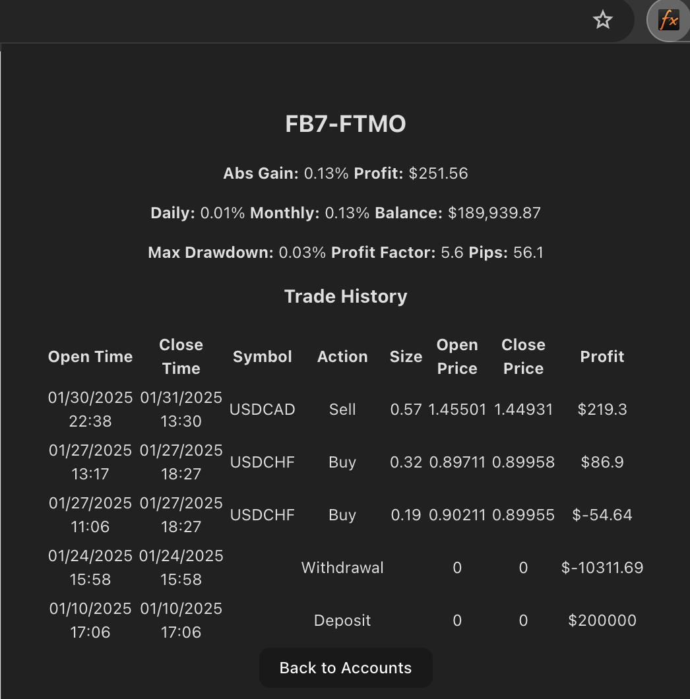
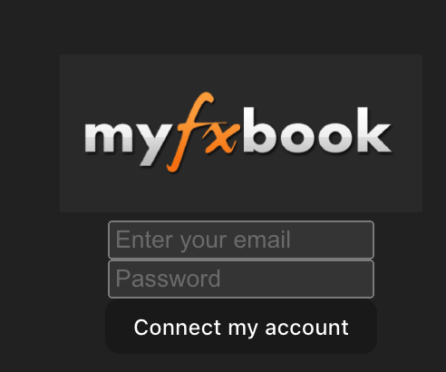
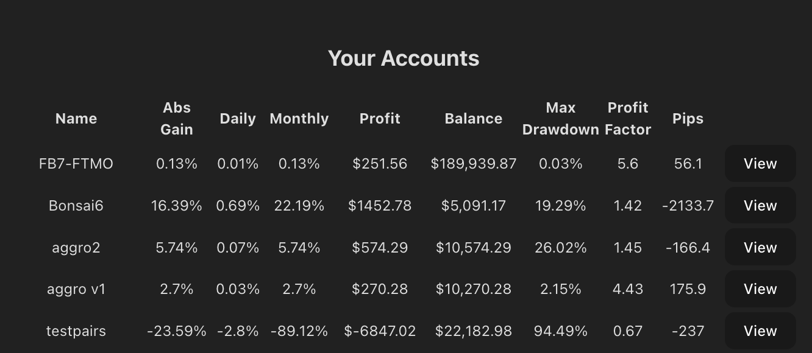

# Myfxbook Account Tracker Firefox / Chrome Browser Extension (WXT)

]FIREFOX EXTENSION](https://addons.mozilla.org/en-US/firefox/addon/myfxbook-account-tracker/) from Mozilla 

Track your trading accounts conveniently without having to open MT4 or sift through myfxbook ads!

## Myfxbook monitoring widget

To get started, make sure you first add your MT4/MT5 account to myfxbook.com

1. Enter your credentials and click **[Connect my Account]** to receive a session token. Your login credentials will not be saved anywhere, only the session token is stored in your browser's local storage.

2. You will see a list of all your accounts, with the newest ones at the top

3. Click **[View]** on the account you're interested in.

### TODO

Pay Google $5 to publish under Chrome addons

## License

MIT